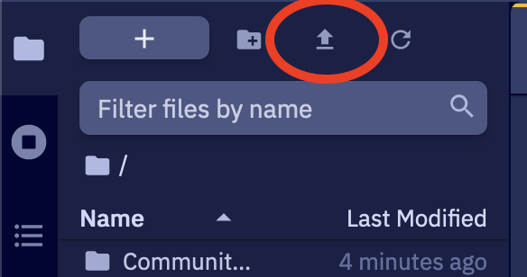

# Epistemix Platform Client

Client for running simulations with Epistemix Platform Cloud.

## Development

### Initial setup

To bootstrap the development environment using a Python virtual environment,
run

```shell
. scripts/setup
```

This will create and activate the development Python environment. This
environment can be reactivated subsequently in a different shell session with

```shell
source .venv/bin/activate
```

### Pre-commit

Before committing, developers are asked to run the following scripts and resolve
any identified issues:

```shell
scripts/test
scripts/format
scripts/lint
```

### Test data generation

Test data is generated in the `scripts/test/tests` directory. Note that the
test data is checked into this repo and should only need to be regenerated
if the generation script needs to be changed. See `resources/tests/README.md`
for more details.

### Testing integration with SRS

The best known way to test `epx_client`'s interaction with SRS is to package
it up, install it in the Platform, and perform manual testing in-situ. This
can be done by following these steps:

#### 1. Create a release candidate

Once you have a version of `epx_client` that you want to test on the Platform,
update the `__version__` number in `src/epx/__init__.py` to a suitable release
candidate. E.g. if the next release is going to be `0.1.1` and this is the
second release candidate, use `0.1.1rc2`. Commit this change so you have a
record in git history of the commit this RC corresponds to.

Next run `scripts/publish`. This will:

1. Create build artifacts for the RC in `dist`: a binary distribution (`*.whl`)
   and a source distribution (`*.tar.gz`).
2. Upload the artifacts to CodeArtifact.

#### 2. Upload the artifact to Platform

Within the Platform environment that you wish to test in, click the upload
file button from the file menu. Navigate to the built `.tar.gz` artifact in
`dist` and upload it to the Platform.



#### 3. Install `epx_client` on the Platform

Use `pip` to install the artifact on the Platform. E.g. if your build artifact
is called `~/packages/epx-0.1.1rc2.tar.gz`, run

```shell
python -m pip install ~/packages/epx-0.1.1rc2.tar.gz
```

This can be done either using the Platform terminal, or from within a notebook.

#### 4. Perform manual tests as required

Note that if you are running in the test environment you will need to configure
the `PLATFORM_API_URL` environment variable to point to the dev API endpoint
rather than the (default) prod endpoint. This can be done in a notebook by
running the following in a cell:

```shell
%env PLATFORM_API_URL=https://studio.dev.epistemix.cloud/v1
```

## Documentation

Documentation for the package uses the [Sphinx](https://www.sphinx-doc.org)
framework in the `docs` directory. To build and locally host the docs at port
`8000` run

```shell
scripts/docs
```
